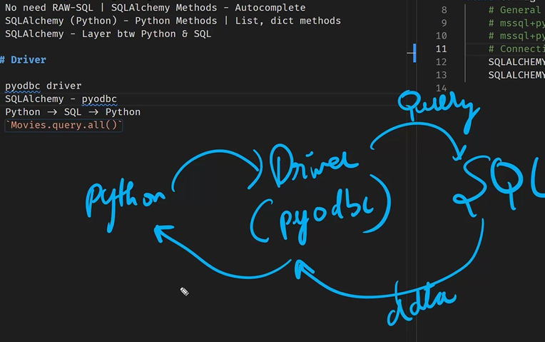

# ORM - Object Relational Mapping

- SQLAlchemy - MSSQL, MySQL, Postgres (Connect to Multiple DB)
- MSSQL -> MYSQL (Migrating)
- No need RAW-SQL | SQLAlchemy Methods - Autocomplete
- SQLAlchemy (Python) - Python Methods| List ,dict methods
- SQLAlchemy - Layer btwn Python & SQL

## Driver

- pyodbc driver
- SQLAlchemy - uses pyodbc
- Python -> SQL -> Python
- `Movies.query.all()`
- 
